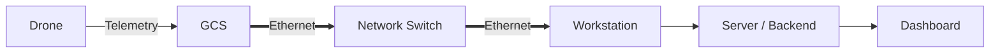

# drone-gcs-telemetry-forwarder

GCS(Ground Control Station)에서 수신한 드론의 위치 정보를 차량 내부 네트워크를 통해 지속적으로 전달하는 모듈입니다.

## 1. System Overview

차량 내부에서 GCS와 Workstation은 동일한 Network Switch에 Ethernet으로 연결됩니다.

```text
Drone
  │
  │ Telemetry
  ▼
GCS
  │
  │ Ethernet
  ▼
Network Switch
  │
  │ Ethernet
  ▼
Workstation
```

본 모듈의 목적은 **GCS가 보유한 드론 위치 정보를 지속적으로 수신하여 Workstation 또는 상위 시스템에서 사용할 수 있도록 전달하는 것**입니다.

---

## 2. Scope

### In Scope

- GCS에서 드론 위치 정보 수신
- 드론 식별 정보 수신
- 위치 정보 정규화
- Workstation 또는 지정된 서버 Endpoint로 지속 전송
- 연결 장애 감지
- 자동 재연결
- 전송 실패 처리
- 송수신 로그 기록
- 영상 스트리밍

### Out of Scope

- 드론 비행 제어
- Mission Planning
- GCS 자체 기능 구현
- Dashboard 구현
- 데이터베이스 구현

---

## 3. Architecture



---

## 4. Data Flow

```text
Drone
  ↓
GCS
  ↓
Drone Position Data
  ↓
Telemetry Forwarder
  ↓
Vehicle LAN
  ↓
Workstation / Server
  ↓
Backend
  ↓
Dashboard
```

처리 순서는 다음과 같습니다.

1. GCS가 드론 Telemetry를 수신합니다.
2. Forwarder가 GCS에서 위치 정보를 획득합니다.
3. 필요한 필드를 공통 데이터 구조로 변환합니다.
4. 차량 LAN을 통해 지정된 Endpoint로 전송합니다.
5. 연결 또는 전송 실패 시 재연결 및 재전송을 수행합니다.

---

## 5. Telemetry Data

최소 전송 대상은 다음과 같습니다.

| Field | Description |
| --- | --- |
| `droneId` | 드론 식별자 |
| `timestamp` | 위치 정보 생성 시각 |
| `latitude` | 위도 |
| `longitude` | 경도 |
| `altitude` | 고도 |

Example:

```json
{
  "droneId": "drone-01",
  "timestamp": "2026-09-10T17:25:00+09:00",
  "latitude": 36.3504,
  "longitude": 127.3845,
  "altitude": 120.5
}
```

---

## 6. Interfaces

### 6.1 Drone → GCS

드론 Telemetry 수신 방식은 사용하는 드론 및 GCS 인터페이스 사양에 따릅니다.

```text
Drone
  ↓
GCS
```

> TODO: 실제 GCS에서 제공하는 Telemetry Interface 확인 필요

---

### 6.2 GCS → Telemetry Forwarder

Forwarder는 GCS가 제공하는 인터페이스를 통해 드론 위치 정보를 수신합니다.

구체적인 Protocol, Port 및 Message Format은 GCS 인터페이스 확인 후 확정합니다.

> TODO
>
> - Protocol
> - Source IP
> - Port
> - Message Format
> - Drone ID 식별 방식
> - Update Frequency

---

### 6.3 Telemetry Forwarder → Server

Forwarder가 수신한 위치 정보는 지정된 서버 인터페이스로 전달합니다.

Example:

```http
POST /api/telemetry/drone
Content-Type: application/json
```

```json
{
  "droneId": "drone-01",
  "timestamp": "2026-09-10T17:25:00+09:00",
  "latitude": 36.3504,
  "longitude": 127.3845,
  "altitude": 120.5
}
```

실제 Endpoint와 Schema는 서버 인터페이스 정의를 따릅니다.

---

## 7. Network

예상 차량 내부 네트워크 구성입니다.

```text
GCS
192.168.x.x
    │
    │ Ethernet
    ▼
Network Switch
    │
    ├──────── Workstation
    │          192.168.x.x
    │
    └──────── Other Vehicle Devices
```

GCS와 Workstation은 동일 차량 LAN에서 통신하는 것을 기본 구조로 합니다.

IP 할당 방식은 실제 차량 네트워크 구성에 따라 결정합니다.

- Static IP
- DHCP
- DHCP Reservation

---

## 8. Reliability

현장 네트워크 환경을 고려하여 다음 기능을 지원하는 것을 목표로 합니다.

- Connection monitoring
- Automatic reconnect
- Request timeout
- Retry
- Local buffering
- Structured logging
- Graceful recovery

GCS 연결이 일시적으로 끊어진 경우 자동으로 연결을 복구해야 합니다.

서버 전송이 불가능한 경우 위치 정보를 일시 저장한 후 연결 복구 시 재전송할 수 있도록 확장할 수 있습니다.

---

## 9. Logging

최소 다음 이벤트를 기록합니다.

```text
GCS_CONNECTED
GCS_DISCONNECTED
TELEMETRY_RECEIVED
TELEMETRY_SENT
SEND_FAILED
RECONNECT_ATTEMPT
RECONNECT_SUCCESS
```

Example:

```json
{
  "timestamp": "2026-09-10T17:25:00+09:00",
  "level": "INFO",
  "event": "TELEMETRY_SENT",
  "droneId": "drone-01"
}
```

---

## 10. Configuration

Example:

```yaml
gcs:
  host: 192.168.10.10
  port: null
  protocol: TBD

server:
  url: https://example.com/api/telemetry/drone
  timeout_sec: 5

telemetry:
  interval_ms: 1000

retry:
  enabled: true
  max_interval_sec: 30
```

실제 `host`, `port`, `protocol` 값은 GCS 인터페이스 확인 후 설정합니다.

---

## 11. Development Status

- [ ] GCS Interface 확인
- [ ] Telemetry 수신 구현
- [ ] Position Parser 구현
- [ ] 공통 Schema 정의
- [ ] Server 전송 구현
- [ ] Reconnect 구현
- [ ] Retry 구현
- [ ] Logging 구현
- [ ] 실제 GCS 연동 시험
- [ ] 장시간 연속 송신 시험
- [ ] 네트워크 장애 복구 시험

---

## 12. Test Scenario

### 정상 통신

```text
Drone
  ↓
GCS
  ↓
Forwarder
  ↓
Vehicle LAN
  ↓
Server
```

검증 항목:

- 위치 정보 정상 수신
- Drone ID 정상 식별
- 서버 정상 전송
- 전송 주기 확인

### GCS 연결 장애

```text
GCS Disconnect
      ↓
Disconnect Detect
      ↓
Reconnect
      ↓
Telemetry Resume
```

### Network 장애

```text
Server Unreachable
      ↓
Send Failure
      ↓
Retry / Buffer
      ↓
Network Recovery
      ↓
Transmission Resume
```

---

## 13. Repository Structure

```text
drone-gcs-telemetry-forwarder/
├── src/
│   ├── gcs/
│   ├── telemetry/
│   ├── transport/
│   └── logging/
├── config/
├── tests/
├── docs/
├── README.md
└── .env.example
```
